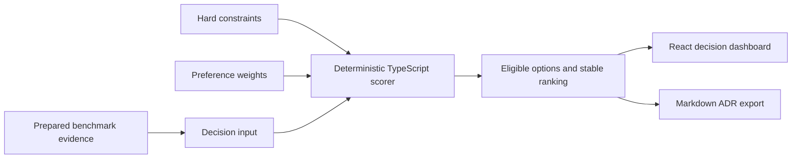

# Berlge

> **Turn architecture debates into deterministic experiments.**

Berlge is a local-first architecture decision workbench. It replaces opinion-led
debates with a repeatable comparison of alternatives: reject options that violate
hard requirements, rank the remaining options against measured evidence and
explicit preference weights, then export the result as a deterministic Markdown
architecture decision record (ADR).

The current MVP demonstrates the approach by comparing **Polling**,
**Server-Sent Events (SSE)**, and **WebSockets** for browser updates.

## Why Berlge?

Architecture decisions often end with the strongest opinion in the room. Teams
may discuss latency, reliability, implementation cost, and operational complexity,
but without a shared decision model those factors are difficult to compare and the
reasoning is difficult to reproduce later.

Berlge makes the decision contract explicit:

1. **Hard constraints gate eligibility.** An alternative that misses a mandatory
   requirement cannot win on preference points.
2. **Evidence makes alternatives comparable.** The demo evaluates test results,
   p95 latency, reconnect time, implementation size, and complexity.
3. **Preference weights expose trade-offs.** Lower-is-better metrics are normalized
   and combined using visible weights rather than hidden intuition.
4. **A stable rule produces the winner.** The same inputs always produce the same
   result, including deterministic tie-breaking.
5. **The reasoning becomes an artifact.** The full decision can be copied or
   downloaded as a Markdown ADR with requirements, weights, evidence, violations,
   scores, winner, and rationale.

The final decision is made by a **deterministic TypeScript scoring engine**. No LLM
participates in scoring, ranking, or tie-breaking.

## Demo: one constraint changes the decision

The bundled experiment uses prepared benchmark evidence and asks which transport
should deliver server-to-browser updates.

| Option | Tests | p95 latency | Reconnect | Implementation | Complexity |
| --- | ---: | ---: | ---: | ---: | ---: |
| Polling | 36/36 | 820 ms | 1,050 ms | 54 lines | 2 |
| Server-Sent Events | 36/36 | 180 ms | 340 ms | 82 lines | 3 |
| WebSockets | 36/36 | 72 ms | 510 ms | 156 lines | 7 |

Preference weights favor implementation size and simplicity (35% each), with p95
latency and reconnect time weighted at 15% each.

- **At a 500 ms maximum p95 latency, SSE wins.** Polling is ineligible. SSE and
  WebSockets both pass the gate, but SSE's smaller, simpler implementation wins
  the weighted trade-off.
- **At a 100 ms maximum p95 latency, WebSockets wins.** Polling and SSE are
  ineligible, leaving the 72 ms WebSockets result as the only eligible option.

This is the core Berlge experience: change a requirement, see eligibility and
ranking recalculate immediately, inspect the evidence, and export the new decision
as a deterministic Markdown ADR.

## Architecture



Everything runs in the browser after the static application loads. The scorer
first records hard-requirement violations, then min-max normalizes the
lower-is-better evidence metrics and applies normalized preference weights.
Ineligible alternatives remain visible for auditability but cannot be selected as
the winner. Equal eligible scores are resolved by a stable candidate-ID rule.

## Run locally

### Prerequisites

- Node.js `^20.19.0` or `>=22.12.0`
- npm

### Setup

```bash
git clone <repository-url>
cd berlge
npm ci
```

### Start the app

```bash
npm run dev
```

Open the URL printed by Vite (normally `http://localhost:5173`).

### Reproduce the demo

1. Start at the default **500 ms** p95 limit and confirm that **Server-Sent
   Events** is recommended.
2. Select the **100 ms** preset and confirm that SSE becomes ineligible and
   **WebSockets** is recommended.
3. Inspect the eligibility states, normalized weighted scores, and recommendation
   rationale in the evidence ledger.
4. Choose **Copy Markdown** or **Download ADR** to export the complete decision.
5. Switch between the presets and export again to verify that the ADR follows the
   active constraint and recommendation.

### Test, lint, and build

```bash
npm test
npm run lint
npm run build
```

The production build is written to `dist/`. To inspect it locally:

```bash
npm run preview
```

## Technology stack

| Area | Technology |
| --- | --- |
| Interface | React 19, semantic HTML, custom CSS |
| Decision engine | Framework-independent TypeScript |
| Development and build | Vite 8, TypeScript 6 |
| Tests | Node.js built-in test runner |
| Linting | Oxlint |
| Output | Deterministic Markdown ADR generated in the browser |

There is no backend, database, authentication layer, external AI API, or runtime
network dependency in this MVP.

## Repository structure

```text
berlge/
├── public/                      # Static public assets
├── src/
│   ├── app/                     # Demo-to-domain integration and view model
│   ├── components/              # Dashboard and export UI components
│   ├── data/                    # Prepared benchmark fixtures
│   ├── domain/                  # Deterministic scoring types and engine
│   ├── lib/                     # ADR and formatting utilities
│   ├── styles/                  # Tokens and responsive dashboard styles
│   ├── App.tsx                  # Interactive experiment composition
│   └── main.tsx                 # React entry point
├── index.html
├── package.json
└── vite.config.ts
```

Tests live beside the decision model, domain engine, and export utilities they
verify. They cover deterministic repeatability, hard-gate behavior, both demo
outcomes, edge cases, and stable ADR generation.

## Built with Agent Orchestrator and Codex

Agent Orchestrator and Codex were used during development to build the scoring
engine, benchmark fixtures and ADR export, dashboard, integration, and final polish
in isolated worktrees. That workflow helped keep each contribution scoped and
verifiable before integration.

They are **development tools, not runtime dependencies**. The MVP does not invoke
Agent Orchestrator, Codex, or any LLM while the app is running, and no model is
involved in the final decision.

## Current MVP limitations

- The demo uses **prepared benchmark evidence** checked into the repository. It
  does not currently execute live load tests, collect telemetry, or validate the
  evidence against deployed systems.
- The UI presents one prepared Polling/SSE/WebSockets scenario. Candidates,
  evidence, and preference weights are currently defined in code; the latency
  constraint is the interactive input.
- Complexity is a supplied ordinal measure, not an automatically derived metric.
- Decisions run and export locally; there is no persistence, collaboration,
  approval workflow, evidence signing, or hosted decision history.
- Agent Orchestrator is not invoked at runtime and the app does not autonomously
  create experiments or implementation worktrees.

## Realistic next steps

1. Define a versioned decision schema and import/export arbitrary candidates,
   constraints, evidence, and weights.
2. Add opt-in benchmark adapters that ingest real test and observability output
   with source metadata, timestamps, and integrity hashes.
3. Let users edit weights and requirements, compare scenarios, and run sensitivity
   analysis without changing source code.
4. Persist decision revisions and add review, approval, and shareable ADR history.
5. Expand constraint types and scoring strategies while retaining deterministic,
   explainable evaluation and comprehensive regression fixtures.

---

**Berlge turns _“I think”_ into _“here is the evidence, the rule, and the
reproducible result.”_**
